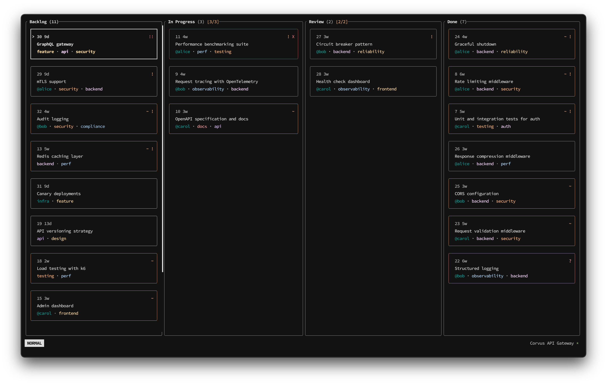

# Kando

A keyboard-first Kanban board that runs right in your terminal.



## Why Kando?

Your board is plain text. Cards are Markdown files with TOML frontmatter, columns are directories, and the whole thing lives in a `.kando/` folder you can commit alongside your code. No server, no browser, no account — just files you can grep, diff, and pipe to whatever you want. Kando adds vim-style navigation, real kanban mechanics (WIP limits, cycle-time metrics, staleness policies), and a scriptable CLI on top.

## Requirements

- A terminal with UTF-8 support
- Optional: install a [Nerd Font](https://www.nerdfonts.com/) and run with `--nerd-font` for fancier glyphs
- Git (optional, for team sync feature)
- SSH agent running (optional, for git sync over SSH)

## Getting Started

```sh
# Install
cargo install --path .

# Create a new board in your project folder
kando init

# Open the board
kando
```

When you first open Kando, you'll see a scrollable tutorial (`j`/`k` to scroll, `Esc` to dismiss). You can also have Kando handle syncing your board to git. See the section on [Team Collaboration](#team-collaboration) for more details.

## The Board

Your board consists of **columns** (like Backlog, In Progress, Done) that contain **cards** (individual tasks). Each card is stored as a plain Markdown file on your computer, so you can always view or edit them outside of Kando if needed.

### What You Can Do With Cards

| Feature | Description |
|---------|-------------|
| **Title & Description** | Every card has a title and a body for notes (Markdown supported) |
| **Tags** | Categorize cards with tags like `bug`, `feature`, `urgent` |
| **Assignees** | Assign cards to team members by name |
| **Priority** | Set priority level (low, normal, high, urgent). Cards auto-sort by priority |
| **Blockers** | Mark a card as blocked when something is preventing progress |
| **Age Tracking** | See how long a card has been sitting around |

### Navigating the Board

The interface is designed for speed. You don't need a mouse.

- `h` / `l` - Move between columns
- `j` / `k` - Move between cards
- `H` / `L` - Move the selected card left or right
- `Enter` - Open card details
- `Tab` / `Shift+Tab` - Cycle through cards across all columns
- `/` - Fuzzy search (supports `!neg` and `@user`)
- `n` / `N` - Jump to next / previous search match
- `f` - Open filter menu
- `s` - Sort current column
- `m` - Show board metrics
- `r` - Reload board from disk
- `u` - Undo last delete
- `|` - Pipe selected card to an external command
- `?` - Show keybinding reference
- `q` - Quit
- `Esc` - Clear any active filters

### Minor Modes

Kando uses "minor modes" (inspired by the Helix text editor) to keep commands discoverable without memorizing dozens of keybindings:

**Press `Space` to see available card actions:**
- `n` - Create a new card
- `d` - Delete the selected card
- `e` - Edit card in your text editor ($EDITOR)
- `t` - Edit tags
- `a` - Edit assignees
- `p` - Change priority
- `m` - Move card to a specific column
- `b` - Toggle blocked status
- `x` - Archive card
- `u` - Undo last delete

**Press `g` to jump quickly:**
- `1`-`9` - Jump to column 1-9
- `g` - Jump to first card in column
- `e` - Jump to last card in column

**Press `c` to manage columns:**
- `h` - Toggle focused column hidden
- `s` - Show or hide hidden columns
- `r` - Rename focused column
- `a` - Add a new column
- `d` - Delete focused column
- `w` - Set WIP limit
- `m` - Enter column move sub-mode
  - `h`/`l` to shift
  - `g`/`e` for first/last
  - `1`-`9` for position

### Searching and Filtering

**Press `/` to search (fuzzy, supports !neg and @user)**
- `n` - Jump to next
- `N` - Jump to previous

**Press `f` to filter the board**
- `t` - Filter by tag
- `a` - Filter by assignee
- `s` - Filter by staleness
- `Esc` - Clear filters

Filters can be combined. For example, you can filter to show only cards tagged `bug` assigned to `alice`.

### Card Details

Press `Enter` on a card to see its full content in a detail pane. From there:
- `j`/`k` - Scroll through long card content
- `Tab`/`Shift+Tab` - Browse other cards without leaving the detail view
- `e` - Edit in your external editor
- `|` - Pipe card to an external command
- `Esc` or `q` - Close detail view

## Piping
Kando lets you pipe any card's raw file contents to a shell command, making it composable with the Unix ecosystem: Clipboard utilities, APIs, AI agents, issue trackers or your own scripts. The card is never modified — piping is a read-only operation.

### Environment variables
Every pipe command also receives the following environment variables so
scripts can access structured card metadata without parsing frontmatter:

| Variable | Description | Example value |
|---|---|---|
| `KANDO_CARD_ID` | Card identifier | `42` |
| `KANDO_CARD_TITLE` | Card title | `Add login page` |
| `KANDO_CARD_TAGS` | Comma-separated tags | `frontend,auth` |
| `KANDO_CARD_ASSIGNEES` | Comma-separated assignees | `alice` |
| `KANDO_CARD_PRIORITY` | Priority level (`low`, `normal`, `high`, `urgent`) | `high` |
| `KANDO_CARD_COLUMN` | Display name of the card's column | `In Progress` |

Tags, assignees, and column values are empty strings when unset.

## Team Collaboration

Kando can sync your board with a git repository, making it easy to collaborate with a team:

```sh
# Initialize with git sync enabled
kando init --branch kando

# Manually sync with remote
kando sync

# Check sync status
kando sync-status
```

How it works:
- Kando creates a "shadow clone" of your git repo in a hidden directory
- Changes are committed and pushed to your specified branch automatically
- When offline, changes are saved locally and synced when you're back online
- Each team member can work on the same board, and changes merge automatically

## Board Policies

Kando can enforce a few lightweight rules to keep your board healthy. All thresholds are configurable and can be disabled by setting them to `0`.

### WIP Limits

Set a maximum number of cards per column. When a column is at capacity, Kando warns you before letting more cards in.

```sh
kando config wip in-progress 3
```

### Staleness Warnings

Cards that go untouched for a configurable number of days get a visual indicator so they don't slip through the cracks.

```sh
kando config stale-days 14
```

### Auto-Close

Cards that stay untouched beyond a second, longer threshold are automatically moved to a target column (typically Archive). This keeps the board clean without manual housekeeping.

```sh
kando config auto-close-days 60
kando config auto-close-target archive
```

### Auto-Archive

Completed cards can be automatically archived after a set number of days so the Done column doesn't grow forever.

```sh
kando config archive-after-days 7
```

## Command Line Interface

Kando isn't just a TUI. You can also manage cards from the command line for scripting and automation:

```sh
# Add a card
kando add "Fix login bug" -t bug,auth -p high -a alice

# List all cards (filter with --column, --tag)
kando list

# Show a card's raw file
kando show 3

# Move a card
kando move 3 done

# Edit a card's metadata
kando edit 3 --priority high --tag-add backend --assignee-add alice

# Delete a card (soft-delete, recoverable from trash)
kando delete 3
```

### Column management
```sh
kando col list
kando col add "Code Review"
kando col rename "in-progress" "Doing"
kando col move "Doing" 2
kando col hide backlog
```

### Archive and trash
```sh
kando archive list
kando archive search "login"
kando archive restore 7 in-progress
kando trash                  # list trashed cards
kando trash restore 5
kando trash purge            # permanently delete trash
```

### Metrics and activity
```sh
kando metrics                # cycle time, throughput, WIP
kando metrics --weeks 8 --csv
kando log                    # stream activity log (JSONL)
kando tags                   # list all tags with counts
```

### Configuration
```sh
kando config show
kando config wip in-progress 3
kando config stale-days 14
kando config auto-close-days 60
kando config auto-close-target archive
kando config archive-after-days 7
kando config trash-purge-days 30
kando config nerd-font on
```

### Diagnostics

If something feels off, `kando doctor` takes a look at your board and tells you what's wrong. It checks that your `.kando/` directory exists and is readable, that `config.toml` parses correctly, that every column has a matching directory on disk, and that all your cards loaded without errors. If you have git sync enabled, it goes further: verifying you're in a git repo, that a remote is configured and reachable, that your SSH agent has keys loaded (for SSH remotes), and that the shadow clone is in place. Each check gets a pass/fail with a suggested fix when something is broken.

```sh
kando doctor
```

This makes it easy to integrate Kando with git hooks, CI pipelines, or shell scripts.

## Card format

All board data lives in a `.kando/` directory in your project/branch.

Each card is a regular Markdown file with TOML frontmatter:

```markdown
---
id = "1"
title = "Fix login bug"
tags = ["bug", "auth"]
assignees = ["alice"]
priority = "high"
created = "2024-01-15T10:30:00Z"
updated = "2024-01-16T14:22:00Z"
blocked = false
---

## Notes

This is the card body. Use regular Markdown here.

- Step 1: Reproduce the issue
- Step 2: Fix it
- Step 3: Write tests
```
